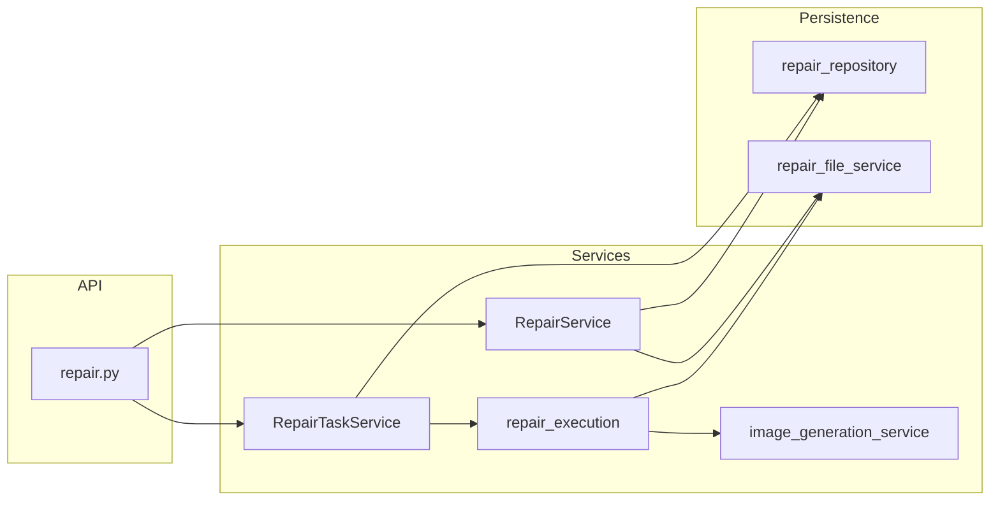

# 图片修补模块前后端代码 Review

**日期**: 2026-04-05  
**范围**: 修补模块 API、领域服务、仓储/模型、前端页面与 Hooks、API 客户端与类型  
**目标**: 架构合理性、可扩展性、冗余与重复、**不破坏现有业务流程**（本报告为评审结论，非强制改码清单）

**修订（同日）**：已按 §7 原「必须 / 建议修复」落实：`FailedUploadInfo.original_filename` 前端对齐、移除误导性 `TaskStatusResponse` Schema、`EditorState` 仅保留于 `types/repair.ts`、模板工具迁至 [`page/src/repair/repairTemplateUtils.ts`](../../page/src/repair/repairTemplateUtils.ts)，并同步 [`async_task_processing.md`](async_task_processing.md)、[`repair_module_api_complete.md`](../api/repair_module_api_complete.md)、[`repair-module.md`](../frontend/repair-module.md)。

---

## 1. 总体评价

修补模块采用 **Routes → Services（RepairService / RepairTaskService）→ Repository → Model** 的分层，异步执行通过 **BackgroundTasks + `asyncio.to_thread` + 独立 DB Session 更新状态**，与轮询 `GET .../status` 配合清晰。前端以 **`repairApi` + `useRepairTasks` / `useRepairTask` + `backendToFrontendTask`** 为主线，数据流可追踪。

**结论**: 架构**合理**、主流程**清晰**；主要改进空间在 **路由层体量与重复样板**、**前端大组件与类型/模块边界**、**少量前后端契约与死代码**，可按优先级渐进优化，避免一次性大改影响线上行为。

---

## 2. 后端：结构与架构

### 2.1 分层与职责（优点）

| 层级 | 代表文件 | 职责 |
|------|----------|------|
| API | [`app/routes/repair.py`](../../app/routes/repair.py) | HTTP、参数校验、`ApiResponse` 封装 |
| 任务 CRUD / 文件 / 模板 | [`app/services/repair_service/repair_service.py`](../../app/services/repair_service/repair_service.py) | 业务编排、响应 DTO 组装 |
| 异步执行 | [`app/services/repair_service/repair_task_service.py`](../../app/services/repair_service/repair_task_service.py) | `start_task`、后台线程、状态回调 |
| 同步流水线 | [`app/services/repair_service/repair_execution.py`](../../app/services/repair_service/repair_execution.py) | 生成 → 落盘 → `update_status` |
| 模型调用 | [`app/services/repair_service/image_generation_service.py`](../../app/services/repair_service/image_generation_service.py) | `build_repair_content`、`generate_repair_images` |
| 磁盘 | [`app/services/repair_service/repair_file_service.py`](../../app/services/repair_service/repair_file_service.py) | 目录、校验、读写删 |
| 持久化 | [`app/repositories/repair_repository.py`](../../app/repositories/repair_repository.py) | `RepairTask` / `PromptTemplate` |
| 校验 | [`app/schemas/repair.py`](../../app/schemas/repair.py) | Pydantic 模型 |

**扩展性**: 更换生成后端时，优先动 `image_generation_service` 与 `nano_banana_pro`，路由与任务状态机可保持稳定。

### 2.2 结构与体量（关注点）

- **`repair.py` 行数多**：每个端点重复「日志 → try → `HTTPException` 分支 → 500」模式，**非功能错误**，但增加维护成本。可选优化（**低风险、可渐进**）：小型依赖函数如 `raise_not_found()`、或按资源拆分子路由（`/tasks`、`/templates`）文件再 `include_router`，**需回归测试**。
- **`RepairService.list_tasks`** 直接使用 `self.db.query(RepairTask)`，与 `RepairTaskRepository` 并存：职责上略重叠，但当前 **list 带动态排序/过滤**，保留在 Service 内也合理；若追求纯粹，可将查询迁入 Repository（**纯重构**）。

### 2.3 数据流（简要）

---

## 3. 前端：结构与状态

### 3.1 优点

- **双 Hook 划分明确**：[`useRepairTasks.ts`](../../page/src/hooks/useRepairTasks.ts) 管列表与创建/删除/快照同步；[`useRepairTask.ts`](../../page/src/hooks/useRepairTask.ts) 管当前任务、上传、轮询、`startRepair`。
- **轮询策略**：`processing` 时轮询，`getTaskStatus` 非 processing 后再 `getTask` 拉全量，避免长期只有简略字段。
- **`applyTaskSnapshot`**：解决侧栏列表与详情状态不一致，属于**有针对性的状态同步**。

### 3.2 关注点

- **[`page.tsx`](../../page/src/pages/repair/page.tsx)**：编排 + 大量视觉结构，**职责偏多**；若后续加功能，建议把「任务操作 / 编辑器协调」抽到自定义 Hook（如 `useRepairPageController`），**不改变 API 调用顺序即可保持行为**。
- **[`TaskEditor.tsx`](../../page/src/pages/repair/components/TaskEditor.tsx)**：体积大，模板面板、标签过滤、localStorage、CRUD 与表单混在一起；**可拆子组件**（仅模板区、仅上传区）以降低认知负担。
- **`EditorState`**：已与 [`types/repair.ts`](../../page/src/types/repair.ts) **单一来源**；`TaskEditor` 仅 import，不再本地重复定义。
- **模板工具模块**：展示用 `PromptTemplate` 与 enrich 自 [`@/repair/repairTemplateUtils`](../../page/src/repair/repairTemplateUtils.ts) 引入（原 `mocks/repairTasks.ts` 已迁移并更名，避免「mock」误导）。

---

## 4. 重复与冗余

| 位置 | 说明 | 建议 |
|------|------|------|
| [`repair.py`](../../app/routes/repair.py) | `GET/POST` 等对 `/tasks` 与 `/tasks/` **双注册** | 有意兼容尾随斜杠则保留；若客户端统一可删一组（**需确认无依赖**） |
| [`repair.py`](../../app/routes/repair.py) | `order_by`/`status`/`image_type` 等与 Schema 或 Service 内集合 **重复校验** | 可收敛到常量 `VALID_TASK_STATUSES` 或依赖 Pydantic Query 模型（**小步**） |
| [`repair_service.py`](../../app/services/repair_service/repair_service.py) | 图片 URL 字符串与前端 [`getImageUrl`](../../page/src/types/repair.ts) **同源逻辑两处** | 后端已返回完整 `url` 时前端主要消费 `url`；若需单一真源，可约定只返回 `filename` 由前端拼（**Breaking 风险**，不推荐贸然改） |
| [`page.tsx`](../../page/src/pages/repair/page.tsx) | 主图 / 参考图 **FileReader 预览** 模式重复 | 抽 `readFileAsDataURL(file)` 小工具 |
| [`app/schemas/repair.py`](../../app/schemas/repair.py) | ~~`TaskStatusResponse`~~ 已移除；[`get_task_status`](../../app/routes/repair.py) 与文档统一为 **`TaskSimple`** |

---

## 5. API 设计与前后端对接

### 5.1 契约一致（良好）

- 统一 `ApiResponse`；任务字段 **snake_case** 与 [`repairApi.ts`](../../page/src/services/repairApi.ts) / [`types/repair.ts`](../../page/src/types/repair.ts) 映射一致。
- `startRepair` 的 `use_reference_images` 与后端 `StartRepairRequest` 一致。

### 5.2 参考图上传失败项（已对齐）

前端 [`FailedUploadInfo`](../../page/src/types/repair.ts) 已与后端一致使用 **`original_filename`**。

### 5.3 未闭环功能（已知）

- [`page.tsx`](../../page/src/pages/repair/page.tsx) `handleContinueRepair`：创建新任务后提示「需要后端支持」，**与业务流程说明一致**，非架构缺陷；落地时需专用 API（如服务端拷贝 result → 新任务 main）或同域下载再上传方案。

---

## 6. 错误处理与日志

### 6.1 优点

- 路由层对 `FileValidationError` / `FileSaveError` / `FileDeleteError` 有区分 HTTP 状态。
- 后台线程内状态更新使用 **新 Session**（[`repair_task_service.py`](../../app/services/repair_service/repair_task_service.py)），避免请求级 Session 关闭导致**静默失败**。
- `repair_execution` 对单张结果保存失败有日志，并在全失败时 `failed`。

### 6.2 可改进点

- 路由层大量 `except Exception → 500`：**丢失业务层 `ValueError` 等细分**的场景已部分用 `HTTPException` 处理；剩余可逐步改为更具体的异常类型（**可选**）。
- 前端 `useRepairTask` 轮询失败仅 `console.error`：**用户无感知**；若需可聚合轻量提示或退避（**产品决策**）。

---

## 7. 建议清单（按优先级）

### 必须修复（高）

- ~~对齐 `FailedUploadInfo`~~ **已完成**（§5.2）。

### 建议修复（中）

- ~~`TaskStatusResponse` / `TaskSimple` 与文档~~ **已完成**（§4、路由 docstring、API 文档）。
- ~~`EditorState` 单一来源；模板工具模块命名/位置~~ **已完成**（§3.2）。

### 可选优化（低）

- 拆分 `repair.py` 或提取路由样板；拆分 `TaskEditor`；`page.tsx` 抽协调 Hook。
- `RepairService.list_tasks` 与 Repository 查询职责再收敛（纯重构）。
- 文档：[`docs/frontend/repair-module.md`](../frontend/repair-module.md) 若仍写「未接 API」，与现状不符处建议修订，避免新成员误读。

---

## 8. 回归建议（任何改动后）

- `pytest tests/test_repair_integration.py -v`
- 前端手动：创建任务 → 主图/参考图 → 提交 → 轮询完成 → 删除任务
- 若有 API 契约变更：同步 [`docs/api/repair_module_api_complete.md`](../api/repair_module_api_complete.md)

---

**Reviewer**: AI Assistant（基于仓库静态代码审阅）
