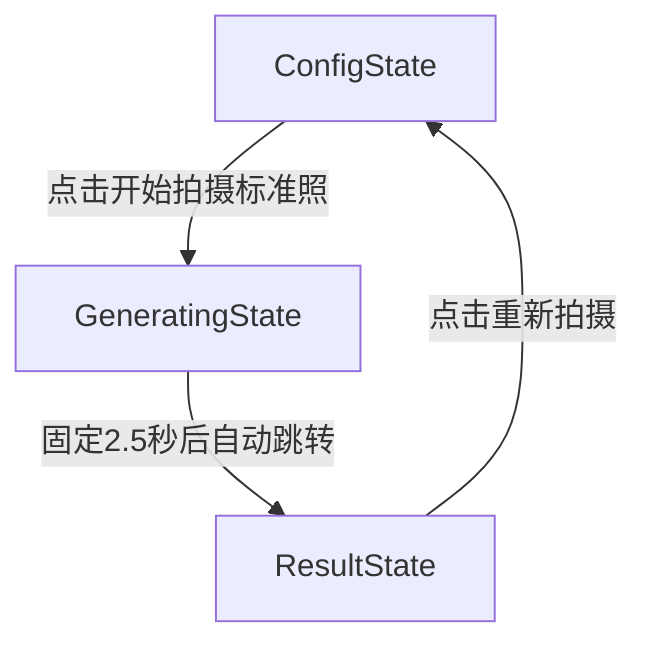

# 素材加工 · 拍摄标准照任务页前端归档

> 文档版本：v1.0  
> 最后更新：2026-04-07  
> 所属模块：`material` / `加工任务` / `拍摄标准照`

---

## 一、功能概述

`拍摄标准照` 是素材加工模块中的核心子任务页，用于从角色原始参考图中生成标准参考照候选图，并支持挑选、预览、保存。

当前实现为前端完整交互流程，包含三阶段状态机：

- `config`：配置阶段（选择参考图 + 类型 + 规格）
- `generating`：生成中动画阶段（简化版等待态）
- `result`：结果展示与保存阶段

---

## 二、文件位置与职责

### 2.1 主要文件

- `page/src/pages/material/components/PhotoTaskPage.tsx`
  - 拍摄标准照完整流程页（状态机与全部交互）
- `page/src/pages/material/components/ProcessTaskTab.tsx`
  - 子任务容器；在 `subTask === "standard"` 时挂载 `PhotoTaskPage`
- `page/src/pages/material/page.tsx`
  - 角色数据传递；将 `selected` 角色透传给 `ProcessTaskTab`
- `page/src/pages/material/components/RawMaterialTab.tsx`
  - 原始参考图管理（已移除标签过滤与标签徽章）

### 2.2 数据来源

- 参考图输入来源：`CharaProfile.rawImages`
- 类型定义：`page/src/types/material.ts` 中 `CharaRawImage`

---

## 三、页面流程（状态机）

说明：

- 配置完成后进入生成态，不依赖真实后端进度
- 生成态采用固定 2.5 秒等待
- 结果态可回到配置态进行二次拍摄

---

## 四、配置阶段（Config）

配置区为三步结构，均在 `PhotoTaskPage` 内部完成：

### Step 1 选择参考图

- 使用角色 `rawImages` 直接渲染缩略图网格
- 支持多选（`Set<string>`）
- 选中态表现：
  - 粉色边框
  - 右上角勾选标记
  - 顶部已选数量徽章
- 空数据提示：引导用户先去原始资料上传参考图

### Step 2 选择标准照类型

- 5 种类型按钮：
  - 全身正面
  - 全身侧面
  - 半身正面
  - 半身侧面
  - 脸部特写
- 选中态为渐变高亮
- 底部展示当前类型说明文案

### Step 3 图片规格

- 长宽比：`16:9` / `1:1` / `9:16`
- 生成数量：`1` / `2` / `4`
- 交互形式为轻量按钮组
- 长宽比带可视化比例预览框

### 主按钮逻辑

- 按钮文案：`开始拍摄标准照`
- 禁用条件：未选任何参考图
- 激活后显示配置摘要（已选张数 / 类型 / 生成数量）

---

## 五、生成中阶段（Generating，精简版）

本阶段已按 v2.3 需求完成简化：

- 保留：
  - 相机图标脉冲动画
  - 三颗星星绕轨道旋转
  - 提示语：`AI 正在认真研究参考图，马上就好，请稍等一下下 ✨`
- 移除：
  - 进度百分比数字
  - 进度条动画
  - 四个步骤标签（分析参考图特征 / 理解角色设定 / 构建标准姿势 / 渲染细节）
- 跳转策略：
  - 固定 `2500ms` 后自动进入 `result` 状态

---

## 六、结果阶段（Result）

结果阶段包含候选图展示、选择、预览、保存：

- 候选图数量由 `genCount` 控制（1 / 2 / 4）
- 点击候选图切换选中态（粉色边框 + 勾选标记）
- 悬停显示 `查看大图` 按钮
- 底部保存栏：
  - 未选中时展示引导文案
  - 选中后激活 `保存为正式标准参考图`
  - 保存后展示绿色成功态
- `重新拍摄`：返回配置阶段

---

## 七、本次相关精简项归档

### 7.1 拍摄标准照页

- 生成中状态已精简为“动画 + 单句提示 + 固定等待”
- 参考图选择网格已移除左下角标签徽章

### 7.2 原始资料页

`RawMaterialTab` 已同步去标签化：

- 移除标签过滤栏（全部 / 全身 / 半身 / 脸部 / 服装 / 其他）
- 移除每张图上的标签操作与标签展示区域
- 图片网格直接渲染全部 `rawImages`

---

## 八、后续接入建议

- 将 `PhotoTaskPage` 的候选图从 Mock 数据替换为真实生成接口
- 生成阶段可改为“接口轮询 + 超时兜底”的混合策略
- 保存动作接入“正式标准参考图”持久化接口，并触发右侧统计刷新

---

## 九、验收清单（前端）

- 能从 `加工任务 -> 拍摄标准照` 进入完整流程
- 未选择参考图时“开始拍摄标准照”按钮禁用
- 生成态不显示进度条与步骤标签，2.5 秒后自动跳转结果页
- 结果图可选择、预览、保存、重新拍摄
- 原始资料页不再出现任何标签过滤与标签徽章

